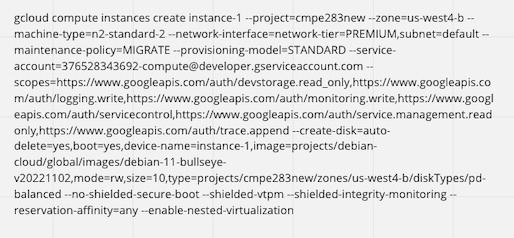
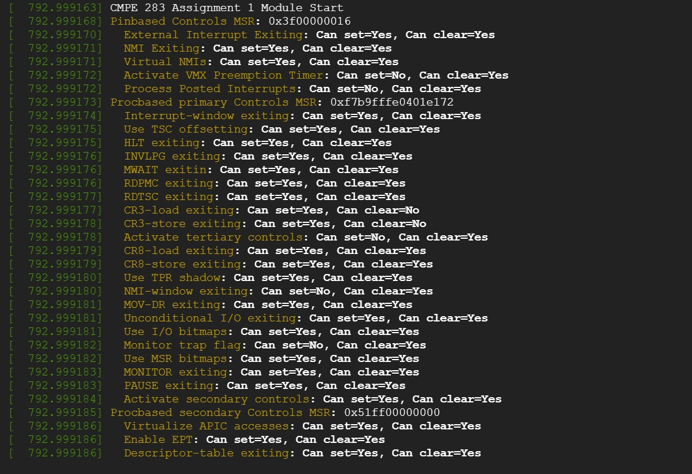
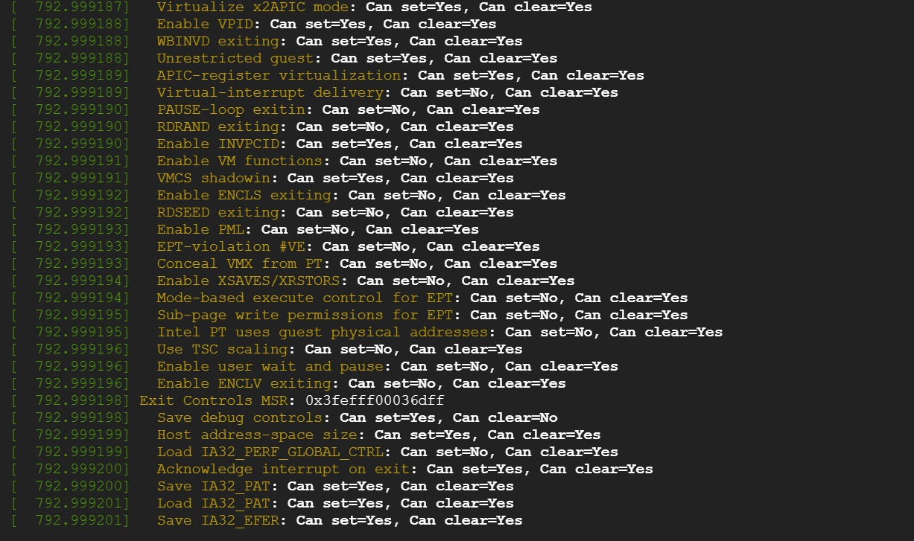
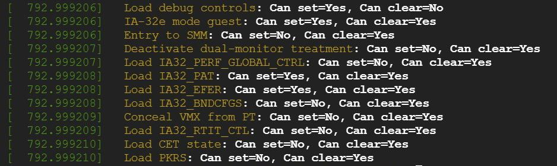

# CMPE283-assignment-1
1. Create a GCP account and create project
2. Next, the project is created, enable the Compute Engine API for that project to create and manage virtual machines.
3. After enabling the Compute Engine API, create a virtual machine instance with the following commanand and then add enable nested virtualization.

4. Instance is created, open the instance using “gcloud compute ssh <<instance_name>>”.
5. We get into the instance next, clone the git repo after changing the “cmpe283-1.c” file. For all the MSRs you can find the code here.
6. File cmpe-281 includes:
      Primary Process based controls (IA32_VMX_PROCBASED_CTLS)
      Secondary process based controls (IA32_VMX_PROCBASED_CTLS2)
      Entry controls (IA32_VMX_ENTRY_CTLS)
      Exit controls (IA32_VMX_EXIT_CTLS)
7. Install the necessary packages (mainly make) in the root user by using the command “apt install gcc make”.
8. Execute the “make” command to create the kernel object.
9. Execute the sudo “insmod cmpe283-1.ko” command to load the kernel object.
10. Finally, view the output use the “dmesg” command.

